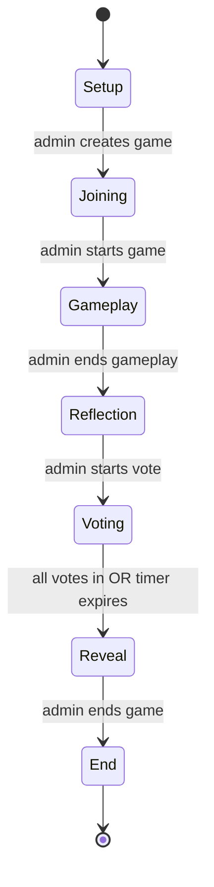

# Data-Tech Among Us Retro — Design Document

A team retrospective run as a cooperative, Among Us–inspired browser game. Players explore a spaceship grid map, answer retro questions to unlock rooms, collect hidden clues, and finally vote on which suspect is the "imposter".

---

## 1. Overview

| Item | Decision |
|---|---|
| Game name | Data-Tech Among Us Retro |
| Hosting | GitHub Pages (static site) |
| Frontend | Vanilla HTML / CSS / JavaScript (ES modules, no build step) |
| Backend | Google Firebase **Realtime Database** (RTDB) for all state and sync |
| Auth | Firebase Anonymous Authentication (one anonymous UID per browser session) |
| Target devices | Desktop-first; must remain usable on tablets |
| Players | 2–15 (including the admin/host, who also plays) |

### 1.1 Core concept

- The game is an end-of-sprint retrospective. Rooms map to classic retro categories (what went well, what didn't, improvements, etc.).
- Answering the question in a room "solves" it, unlocking adjacent rooms and possibly revealing a hidden clue.
- The **imposter is not a player.** The admin defines a fictional *suspect list* during setup and secretly marks one suspect as the imposter. Clues found in rooms help the team deduce who it is.
- The team works cooperatively during gameplay; the vote at the end is individual.

---

## 2. Roles

### 2.1 Admin / Host
- Creates the game and configures it (Section 4).
- Receives the generated **game code** and shares it with players.
- Is also a regular player: moves on the map and answers questions.
- Controls phase transitions (advances phases manually).
- **Cannot vote** in the voting phase (they know the imposter).
- Can kick a player during the joining phase.

### 2.2 Player
- Joins with the game code, a display name, and a colour.
- Moves on the map, answers questions, collects clues.
- Votes for a suspect during the voting phase.

---

## 3. Game Phases

The game is a strict state machine. The current phase is stored once in RTDB and every client renders according to it. Only the admin can advance the phase, always forward, never backward.



| # | Phase | Who acts | Ends when |
|---|---|---|---|
| 1 | Setup | Admin configures the game | Admin submits config; game + code created |
| 2 | Joining | Players join via code | Admin clicks **Start Game** (min. 2 players total) |
| 3 | Gameplay | All players (incl. admin) play the map | Admin clicks **End Gameplay** |
| 4 | Reflection | Team reviews all questions & answers together | Admin clicks **Start Voting** |
| 5 | Voting | Players (not admin) vote for a suspect | All votes submitted **or** vote timer expires |
| 6 | Reveal | Votes then imposter are revealed to everyone | Admin clicks **End Game** |
| 7 | End | Everyone views game summary | — (game is read-only) |

Phase-specific behaviour is detailed in Sections 4–10.

---

## 4. Phase 1 — Setup

The admin fills in a single setup form:

| Field | Type | Constraints | Default |
|---|---|---|---|
| Admin name | text | 1–20 chars | — |
| Admin colour | colour picker (from palette, Section 12.2) | — | first free colour |
| Grid size | select | 5×5, 7×7, or 9×9 (odd, square) | 7×7 |
| Room types in play | multi-select of the 7 typed rooms (Section 6) | ≥ 1 selected | all 7 |
| Suspect list | list of names | 3–12 fictional names, unique | — |
| Imposter | select one suspect from the list | exactly 1 | — |
| Hints/clues | list of free-text clues | 1–20 clues | — |
| Vote timer | select | 1, 2, 3, or 5 minutes | 3 min |

On submit, the client:

1. Signs in anonymously to Firebase.
2. Generates a **6-character game code** (uppercase A–Z minus ambiguous chars `I O`, plus digits 2–9), retrying on collision.
3. Generates the map (Section 5.2), assigns room types and questions (Section 7), and randomly distributes hints into distinct rooms (Section 8).
4. Writes the full game object to RTDB under `/games/{code}` with `phase: "joining"`.
5. Adds the admin as the first player and shows the lobby with the code displayed prominently.

Validation: number of hints must be ≤ number of non-start rooms. The imposter identity is written to a location that clients never render until the reveal phase (Section 13.2 covers trust level).

---

## 5. The Map

### 5.1 Layout

- Square grid of N×N rooms (N ∈ {5, 7, 9}).
- The **centre cell** is the **Start room** (hub, no question, always "solved"). All players begin here.
- Every other cell is a room with exactly one question.

### 5.2 Map generation (at setup)

1. Create the N×N grid; mark the centre as Start.
2. Shuffle the list of selected room types. Assign types round-robin to a random ~60% of the remaining cells; all unassigned cells become **Storage**. (Guarantees every selected type appears at least once when the grid has enough cells.)
3. For every non-Storage room, pick a random unused question from that type's pool (Section 7). Storage rooms get the generic Storage prompt.
4. Distribute hints into randomly chosen distinct non-start rooms (Section 8).

### 5.3 Accessibility rules

- A room is **accessible** when it is orthogonally adjacent (up/down/left/right — no diagonals) to a solved room. The Start room counts as solved.
- A room's **type is visible only when the room is accessible.** Inaccessible rooms render as locked/undiscovered cells.
- Solved rooms are visibly marked and can no longer be entered.

### 5.4 Movement & occupancy

- Players are rendered on the map as coloured name tags in the room they occupy. Multiple players may stand in the Start room and in solved rooms.
- **Only one player at a time may occupy an unsolved room.** Occupancy is claimed atomically via an RTDB transaction on the room's `occupantId` field (first writer wins; losers get a "room occupied" message).
- Flow when clicking an accessible, unoccupied, unsolved room:
    1. Client claims occupancy (transaction).
    2. Question preview modal opens showing the room type and question, with **Accept** / **Go Back**.
    3. **Go Back** releases occupancy (`occupantId = null`) and returns the player to their previous location; another player may now enter.
    4. **Accept** locks the player into answering; the answer form opens.
- On disconnect, `onDisconnect()` handlers release any room occupancy the player holds and mark them offline (Section 11).

---

## 6. Room Types

| Type | Retro category | Question theme |
|---|---|---|
| Storage | Open floor | Default room. Free-text: "Leave any comment about the sprint." |
| Medical Bay | What didn't go well | Problems, pain points, failures during the sprint |
| Recreation Room | What went well | Wins, highlights, things to keep doing |
| Cafeteria | Serenity | Team mood, morale, sustainability of pace |
| Engine Room | Improvements | Concrete ideas for improvement / experiments |
| Navigation | Learning | Things learned, new skills, discoveries |
| Security | Risks & blockers | Risks and blockers encountered during the sprint |
| Conference Room | Teamwork | Collaboration, communication, ways of working |

Rooms without an assigned type are Storage. The Start room is a special hub with no question.

---

## 7. Question Pool

- Questions are **built-in**, shipped as a static JS module (`questions.js`): a map of room type → array of ≥ 8 question strings.
- At map generation each room draws a random question from its type's pool **without replacement** within that type (re-use only if the pool is exhausted on large grids).
- Every question is answered with **free text** (1–500 chars). One question, one answer per room; the first submitted answer solves the room.

Example pool entries:

- Medical Bay: "What was the most frustrating moment of this sprint and why?"
- Recreation Room: "What is one thing the team did this sprint that we should definitely do again?"
- Engine Room: "If you could change one thing about our process next sprint, what would it be?"
- Navigation: "What is something you learned this sprint that you didn't know before?"
- Security: "What blocked you the longest this sprint? Is it resolved?"
- Conference Room: "When did collaboration work best this sprint? What made it work?"
- Cafeteria: "On a scale of 1–10, how sustainable did this sprint's pace feel? Explain."

The full pool is authored during implementation and reviewed by the team; it must be trivial to extend by editing `questions.js`.

---

## 8. Hints / Clues

- The admin authors 1–20 free-text clues at setup (e.g. "The imposter was on leave during the incident", "The imposter drinks tea, not coffee").
- Each clue is placed in a **distinct, randomly chosen non-start room** at map generation.
- A clue is **discovered** when its room is solved. The solving player sees a "You found a clue!" toast, but the clue text remains hidden.
- During gameplay, the team sees only a counter: "Clues found: 3 / 8".
- **All discovered clues are revealed to everyone at the start of the voting phase.** Clues in rooms that were never solved stay hidden forever (they appear greyed-out as "undiscovered" in the end summary).

---

## 9. Phases 3–4 — Gameplay & Reflection

### 9.1 Gameplay

- All players (including the admin) move and answer per Sections 5–7.
- Answers are **not** visible to other players during gameplay — only which rooms are solved and by whom.
- HUD shows: game code, phase, player list with online status, rooms solved counter, clues found counter.
- The admin has an **End Gameplay** button (with confirmation dialog). There is no automatic end; the admin decides when the retro timebox is up, even if rooms remain unsolved.

### 9.2 Reflection

- The map is frozen (no movement, no answering).
- All clients show a synchronized review view: the list of solved rooms with room type, question, answer, and answering player, grouped by room type (i.e. by retro category).
- The admin drives discussion verbally (the team is expected to be in a call or co-located); the admin's client controls a shared "currently highlighted room" pointer so all screens focus on the same item.
- Unsolved rooms and clue texts are **not** shown here.
- Admin advances with **Start Voting**.

---

## 10. Phases 5–7 — Voting, Reveal, End

### 10.1 Voting

- On entry, all discovered clue texts are revealed to every player.
- Each non-admin player sees the suspect list and picks exactly one suspect. Votes are secret until reveal and cannot be changed after submission.
- The admin does not vote; their screen shows voting progress ("4 / 6 votes in") and the countdown.
- A **vote timer** (configured at setup) starts when the phase begins. The phase auto-advances to Reveal when **all eligible players have voted** or the **timer expires**, whichever is first. Players who didn't vote in time are recorded as "no vote". The timer is enforced by clients against the phase-start timestamp stored in RTDB; the admin client performs the actual phase write (with any online client as fallback if the admin disconnects).

### 10.2 Reveal

Two-step reveal, both steps visible to all players simultaneously:

1. **Votes revealed:** a tally per suspect, with each voter's name and colour shown next to their vote.
2. **Imposter revealed** (admin clicks "Reveal imposter", 3-second dramatic countdown animation): the imposter's name is displayed, plus a "The crew was right! / The imposter got away!" banner depending on whether the plurality vote matched. Ties count as the imposter getting away.

### 10.3 End / Summary

Read-only summary screen for all players:

- Result banner (crew won / imposter got away).
- Vote breakdown and the imposter's identity.
- All clues (discovered + undiscovered, undiscovered marked as such).
- Full Q&A list grouped by retro category — this is the retro output. A **"Copy summary as Markdown"** button exports the grouped Q&A + clues + result to the clipboard so it can be pasted into the team wiki.
- Stats for fun: rooms solved per player, clues found per player.

Games are not deleted automatically; stale-game cleanup is out of scope for v1.

---

## 11. Presence & Disconnects

- Each client registers `onDisconnect()` handlers that set `players/{uid}/online = false` and clear any `occupantId` they hold.
- Rejoining: a returning player (same browser, same anonymous UID) resumes their identity. A player whose UID is lost can rejoin during any phase with the same name; the admin can kick duplicate/ghost entries in the joining phase only.
- If the **admin** disconnects mid-game, the game simply pauses at the current phase until they return (no admin handover in v1).

---

## 12. UI / Screens

### 12.1 Screen inventory

| Screen | Phase(s) | Key elements |
|---|---|---|
| Landing | — | "Create Game" and "Join Game" entry points |
| Setup form | 1 | All setup fields (Section 4) |
| Join form | 2 | Code, name, colour picker (taken colours disabled) |
| Lobby | 2 | Game code (large), player list, admin: Start Game / kick buttons |
| Game board | 3 | Grid map, HUD, question modal, answer form |
| Reflection view | 4 | Grouped Q&A list, shared highlight pointer |
| Voting view | 5 | Clue list, suspect ballot, timer; admin: progress view |
| Reveal view | 6 | Vote tally, imposter reveal animation |
| Summary view | 7 | Full summary + Markdown export |

### 12.2 Visual style

- Among Us–inspired: dark space background, chunky rounded shapes, crewmate-coloured name tags.
- **Colour palette (12):** red, blue, green, pink, orange, yellow, black, white, purple, brown, cyan, lime. Each colour is unique per game; the join form disables taken colours.
- Rooms render as tiles: locked (dark, unlabeled), accessible (lit, type icon + name), occupied (occupant's name tag), solved (checkmark + solver's colour).
- All state changes render live via RTDB listeners — no refresh ever needed.

### 12.3 File structure (implementation guide)

```
/
├── index.html          # single page, screens toggled by JS
├── css/style.css
├── js/
│   ├── main.js         # entry, routing between screens
│   ├── firebase.js     # init, auth, RTDB helpers
│   ├── game.js         # phase state machine, admin actions
│   ├── map.js          # generation, rendering, accessibility logic
│   ├── questions.js    # built-in question pools
│   ├── voting.js       # voting, reveal, summary
│   └── ui.js           # modals, toasts, shared components
└── firebase.rules.json # RTDB security rules (deployed separately)
```

---

## 13. Data Model (Firebase RTDB)

### 13.1 Structure

```jsonc
{
  "games": {
    "{CODE}": {
      "meta": {
        "createdAt": 1724800000000,
        "adminUid": "abc123",
        "phase": "gameplay",          // setup|joining|gameplay|reflection|voting|reveal|end
        "phaseStartedAt": 1724800300000,
        "gridSize": 7,
        "voteTimerSec": 180,
        "highlightedRoom": "r3_4"     // reflection-phase shared pointer, nullable
      },
      "players": {
        "{uid}": {
          "name": "Uzair",
          "color": "cyan",
          "isAdmin": true,
          "online": true,
          "location": "start"          // "start" | roomId
        }
      },
      "rooms": {
        "r{row}_{col}": {
          "type": "engine",            // storage|medical|recreation|cafeteria|engine|navigation|security|conference|start
          "question": "If you could change one thing...",
          "occupantId": null,          // uid or null, claimed via transaction
          "solved": false,
          "solvedBy": null,            // uid
          "answer": null,              // free text, written on solve
          "hintIndex": null            // index into secrets/hints, null = no hint; see 13.2
        }
      },
      "secrets": {                     // never rendered before the appropriate phase
        "suspects": ["Alice", "Bob", "Charlie"],
        "imposterIndex": 1,
        "hints": ["Clue text 1", "Clue text 2"]
      },
      "cluesFound": { "0": true, "2": true },   // hintIndex -> discovered
      "votes": {
        "{uid}": 2                     // suspectIndex; absent = not voted
      }
    }
  }
}
```

### 13.2 Trust model (explicit trade-off)

This is a static app with no server code, so the imposter identity and hint texts live in RTDB and are technically readable by a player who opens dev tools. **Accepted for v1** — this is a friendly team game, not a security-sensitive product. Mitigations:

- Clients never fetch `secrets/imposterIndex` until the reveal phase and never render hint texts until voting.
- RTDB security rules restrict writes (below) but reads of a joined game are open to its players.

Do **not** invest in obfuscation/encryption for v1.

### 13.3 Security rules (requirements)

- Only authenticated (anonymous) users can read/write.
- `meta/phase` and `secrets` writable only by `adminUid`.
- A player can write only their own `players/{uid}` node and their own `votes/{uid}` (and only during the voting phase, and only once).
- `rooms/*/occupantId` claimable only when currently `null` (transaction) or by its current holder (release).
- `rooms/*/answer`, `solved`, `solvedBy` writable only by the room's current occupant, only while `solved == false`.
- Validate string lengths (name ≤ 20, answer ≤ 500) in rules.

---

## 14. Edge Cases & Rules Summary

| Case | Behaviour |
|---|---|
| Duplicate name on join | Rejected — names unique per game |
| Colour taken | Disabled in picker; race resolved by transaction, loser re-picks |
| 2 players click same room | RTDB transaction; loser sees "room occupied" |
| Player closes tab mid-question | `onDisconnect` frees the room; question unanswered, room unsolved |
| Admin ends gameplay while someone is answering | In-flight answer submission is accepted if it lands before the phase write; otherwise discarded with a notice |
| All rooms solved before admin ends phase | Banner "All rooms complete!" shown; admin still advances manually |
| Tie in votes | Imposter "got away" |
| No votes cast (timer expires) | Straight to reveal; imposter got away |
| Invalid/expired game code on join | "Game not found" error |
| Join attempt after gameplay started | Rejected with "Game already in progress" (v1: no late joins) |

---

## 15. Out of Scope (v1)

- Late joining / spectator mode
- Admin handover on disconnect
- Automated stale-game cleanup
- Mobile-phone-optimised layout (tablet+ only)
- Sound effects / music
- Multiple imposters, player-imposters, sabotage mechanics
- Server-side secret protection (see 13.2)

---

## 16. Implementation Milestones

1. **M1 — Static shell & Firebase plumbing:** landing, setup, join, lobby; game creation and player join with live player list.
2. **M2 — Map & gameplay:** map generation, rendering, accessibility, occupancy transactions, question/answer flow, clue discovery counter.
3. **M3 — Reflection & voting:** frozen review view with shared highlight, clue reveal, ballot, vote timer, reveal animation.
4. **M4 — Summary & polish:** end summary with Markdown export, security rules, presence/disconnect handling, visual polish, edge-case hardening.
